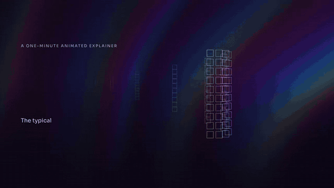

<p align="center"></p>

<h1 align="center">Mortiflix</h1>

<p align="center"><b>A motion design studio on your own machine.</b><br>
Claude makes the video step by step. You approve every stage.</p>

<p align="center"><a href="https://youtu.be/53bRoQENmSA"></a><br>
<b>▶ <a href="https://youtu.be/53bRoQENmSA">Watch: How to use Mortiflix</a></b> (3:07). This video was made with Mortiflix.</p>

---

Most "AI video" tools are one prompt and a slot machine. Mortiflix works like a real motion design studio:
a brief, a script, style frames, a transition board, an animatic, a final, and **you review each stage** before the next one starts.
You pin a note on the exact spot of a frame or the exact moment of a video. The next version answers every note,
one by one, and shows you what changed.

It's built for **one person**: you write the briefs, you review every stage, and the studio runs on your machine.
The work is done by Claude through **your own Claude Code login or your own Anthropic API key**. Mortiflix is
the harness around it: the pipelines, the gates, the review room, and the memory that carries a project across
sessions and days.

```
 brief ──▶ script ──▶ style frames ──▶ animatic ──▶ build ──▶ final ──▶ delivered
   ▲          ▲            ▲              ▲                     ▲
   └── you ───┴──── you ───┴───── you ────┴──────── you ────────┘
       approve, pin notes, answer questions (the session stops at every gate)
```

## Why it's built this way

- **Sessions end at gates.** A Claude session works until it has something for you to review, submits it, writes a
  handoff and stops. When you respond, a fresh session picks up from the journal. Waiting on you costs nothing,
  for hours or for days.
- **The rules live in code, not in the prompt.** Only you can approve a step you review. A submission is refused if
  it doesn't report every error check for its kind of work, or if it doesn't answer each note you left on the last
  version. What you reviewed is copied out of the session's reach, so it can't change afterwards.
- **It learns your studio.** When you point out a real mistake, the session proposes a new check ("text never
  touches the frame edge"). Approve it once and every future video runs it. Your taste carries across projects in
  `TASTE.md`.
- **Pipelines are folders.** A pipeline is a `pipeline.json` (steps, how each is reviewed, the error checks), a
  `PIPELINE.md` (the craft), and skills. Anyone can write one: that's the point of open-sourcing it.

## Quick start

> **Tested mostly on Linux so far.** A Windows version is coming in the next two weeks (by October 20, 2026). macOS
> should mostly work but hasn't been tested yet.

You need **Node 20+** and **ffmpeg**. For real videos you also need one of:
- [Claude Code](https://claude.com/claude-code), logged in (your plan pays), or
- an [Anthropic API key](https://console.anthropic.com/) (you pay per token).

```sh
git clone https://github.com/GTKottman/mortiflix-oss.git && cd mortiflix-oss
npm install
npm link                 # puts `mortiflix` on your PATH (or use: node bin/mortiflix)

mortiflix init           # makes the studio folder (~/Mortiflix) and picks a backend it finds
mortiflix setup          # the walkthrough: Claude, narration, music, assets, 3D (asks before installing anything)
mortiflix demo           # a full walk-through with placeholder work: free, no Claude needed
```

Then either:

**A. In the terminal**

```sh
mortiflix new explainer          # asks the brief's questions
mortiflix run                    # sessions run until something waits on you
mortiflix review                 # read the note, answer questions, pin notes, approve or ask for changes
mortiflix run                    # ...and so on until it's delivered
```

**B. In the browser**

```sh
mortiflix serve                  # http://127.0.0.1:4646
```

The web studio shows what's waiting on you, a live log of what Claude is doing, and the review room: click a frame
to pin a note, pause a video to note a moment, comment on a paragraph of the script, answer the session's questions,
and approve. Sessions start by themselves while `serve` runs. To use it from another device, run
`mortiflix serve --host 0.0.0.0`: you then get a private link with an access token (put it behind HTTPS if it leaves
your network).

## Backends

| Backend | What runs | Who pays |
|---|---|---|
| `claude-code` | `claude -p` in the project folder, with your login | your Claude plan |
| `anthropic-api` | Mortiflix's own agent loop on the Claude API: a persistent shell, a file editor that can *show* Claude the frames it renders, web search, prompt caching, compaction for long sessions | your API key, per token |
| `demo` | a scripted stand-in that walks every gate with placeholder frames and a test-pattern video | nobody |

Pick one with `mortiflix init --backend …`, `mortiflix config backend …`, or Settings in the web studio.
Each project shows what its Claude work cost: on a Claude plan, what it **would have cost** at API prices (you didn't
pay that); with an API key through Claude Code, about what you spent.

## Your keys

Mortiflix runs on your own accounts: there's nothing to sign up for. `mortiflix init` asks for your keys, and
`mortiflix keys` changes them any time (Settings › Keys in the web studio does the same):

```
Anthropic API key   only for the anthropic-api backend (Claude Code uses your own login)
ElevenLabs API key  only for ElevenLabs narration, sound effects and music
Other keys          anything a pipeline's tools read from the environment, e.g. GEMINI_API_KEY
```

Typing is hidden, each key is checked with a free API call before it's saved, and they're written to the studio
folder only (`secrets.json` and `session.env`, mode 600). If a project needs a key you haven't added, it asks
**before it starts** (`mortiflix new`, or the web studio's Start button) instead of failing halfway through.
For scripts: `echo "$KEY" | mortiflix keys set elevenlabs`.

## What it can make today

| Pipeline | Steps you review | Good for |
|---|---|---|
| `explainer` | brief → script → style frames → transitions → animatic → music → final | 30 s to 2 min explainers, narrated or not, with an original score |
| `social-short` | brief → hook frames → transitions → final | 45 s to 3 min vertical shorts: hook first, works with sound off |
| `logo-sting` | directions → final | a 3–8 s logo animation; the quickest real run |

They build in [Remotion](https://www.remotion.dev/) (React video) and check every render with ffmpeg (`qc.mjs`:
format, black or frozen frames, loudness, a frame sheet Claude has to look at). Remotion has its own license: free for individuals and small teams, a company
license above that. Check it for your case.

## Narration

Pick a voice in **Settings › Narration** (or `mortiflix voice`):

- **ElevenLabs**: connect your key and choose from your voices, the default voices or the Voice Library, with
  Eleven v4 by default and every option the API offers (models, stability and similarity, language, text
  normalization, pronunciation dictionaries, audio format, data-residency servers), plus sound effects and music
  beds. Settings shows your plan, credits, and whether you may use the audio commercially (the free plan doesn't).
- **This computer**: Qwen3-TTS (open, Apache-2.0) through ComfyUI on your graphics card: free and private. Mortiflix
  checks your GPU and offers it when it fits (4 GB for the 0.6B voice, 8 GB for the 1.7B voice with delivery
  instructions).
- **Your own voice**: you read the script yourself, one short line at a time, in the **recording booth**: in the web
  studio (hold Space to record, listen back, keep the best take), in a terminal (`mortiflix record <project>`), or by
  importing files you recorded elsewhere (`mortiflix record <project> --import <folder>`). The studio asks for you when
  the script is ready and carries on once every line has a kept take.
- **None**: on-screen text and music.

Generated lines are checked by speech to text and retaken if words go missing; word timings drive the animation.
Details: [docs/VOICE.md](docs/VOICE.md).

## Transitions

Before the animatic, every project gets a **transition board**: for each change from one style frame to the next,
the object or idea on screen that carries it, why the cut happens there, the word it lands on, and real in-between
frames rendered from the two style frames and the chosen transition. Transitions come from the
[remotion-transitions](https://github.com/GTKottman/remotion-transitions) library (installed by setup), or are new
ones inspired by it. The screen never goes blank: no dip to a flat colour, no flash to white. A check reads every
10% of every transition and fails any frame that does.

## Setup: music, assets and 3D

`mortiflix setup` (or **Settings › Setup**) explains each part, why it's needed and what it installs, then asks.
Everything goes into the studio folder, never system-wide. Full details: [docs/SETUP.md](docs/SETUP.md).

- **Music.** After you approve the animatic, the studio scores it with original music written in
  [Strudel](https://strudel.cc): a dramatic reading, a spotting map from the video's real timing, a blueprint whose
  sections build, hold back and hit exactly where the picture needs, and a machine check (harmony locked to the
  chart, every hit within a frame, the intensity curve as planned) before you hear it. Strudel renders it itself.
  Optionally, a **MIDI pack** (every part, stems, a cue sheet) to remake it in your own DAW.
  [docs/MUSIC.md](docs/MUSIC.md)
- **Assets.** If you have a website you use for assets, list it: sessions search it and download what fits in your
  own Chrome, with your own login, through browser-use's [browser-harness](https://github.com/browser-use/browser-harness),
  recording every asset's source and licence. Without one, sessions make every visual themselves.
- **3D.** Blender with the studio's toolkits, in its own profile (your Blender setup is never touched): MoBlend
  (MoGraph), Camera, Animate, Math, Circuits, Camera Flight for flying the camera yourself (`mortiflix blender`), and
  **Nova FX**, Mortiflix's own particle engine (particles, fire, sparks, fireworks), which builds on Linux only for now.

## Make your own pipeline

```sh
cp -r pipelines/logo-sting ~/Mortiflix/pipelines/my-pipeline   # the studio's own pipelines override built-ins
$EDITOR ~/Mortiflix/pipelines/my-pipeline/pipeline.json
mortiflix pipelines                                             # validates it
mortiflix new my-pipeline --backend demo                        # walk its gates for free
```

Read **[docs/PIPELINES.md](docs/PIPELINES.md)**. This is where help is most wanted: music videos, product films,
data stories, kinetic type, 3D in Blender, captions for existing footage. If you can describe how a good studio
makes it, it can be a pipeline.

## How it works

- [OVERVIEW.html](OVERVIEW.html): the whole project on one page, with UML diagrams (download it and open it in a browser)
- [docs/ARCHITECTURE.md](docs/ARCHITECTURE.md): the runner, the bridge (`mfx`), the gates, the session brief, the backends
- [docs/PIPELINES.md](docs/PIPELINES.md): the pipeline format and how to write a good one
- [harness/GATES.md](harness/GATES.md): the protocol every session follows
- [docs/SECURITY.md](docs/SECURITY.md): what a session can and can't reach, and the web server's guards
- [docs/COMPUTE.md](docs/COMPUTE.md): where the tokens, time and disk go, measured on a real project
- [docs/VOICE.md](docs/VOICE.md): narration with ElevenLabs or on your own GPU, and every option
- [docs/SETUP.md](docs/SETUP.md): every part of setup, what it installs and where
- [docs/MUSIC.md](docs/MUSIC.md): how the music step writes, checks and renders a score

## Where it came from

Mortiflix began as a hosted motion design studio, where every video was made stage by stage behind the same kind of
gates, with clients approving each one. This repository is that process, boiled down to one machine and opened up,
so it can be improved by more people than one studio.

Not here yet (from the hosted studio, contributions welcome): workflow
preferences learned from your pins, redo rounds on a delivered video, share links, music in the social-short pipeline,
and more pipelines (codebase explainers, 3D music videos, real estate films).

## Contributing

See [CONTRIBUTING.md](CONTRIBUTING.md). Tests run in about a second (`npm test`) and never call the network.

## License

[AGPL-3.0](LICENSE). If you run a modified Mortiflix as a service for others, share your changes.
The bundled fonts (Sora, Unbounded) are under the SIL Open Font License (`web/fonts/`).
