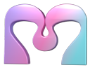

<p align="center"></p>

<h1 align="center">Mortiflix</h1>

<p align="center"><b>A motion design studio on your own machine.</b><br>
Claude makes the video step by step. You approve every stage.</p>

---

Most "AI video" tools are one prompt and a slot machine. Mortiflix works like a real motion design studio:
a brief, a script, style frames, an animatic, a final, and **you review each stage** before the next one starts.
You pin a note on the exact spot of a frame or the exact moment of a video. The next version answers every note,
one by one, and shows you what changed.

It's built for **one person**: you write the briefs, you review every stage, and the studio runs on your machine.
The work is done by Claude through **your own Claude Code login or your own Anthropic API key**. Mortiflix is
the harness around it: the pipelines, the gates, the review room, and the memory that carries a project across
sessions and days.

```
 brief ──▶ script ──▶ style frames ──▶ animatic ──▶ build ──▶ final ──▶ delivered
   ▲          ▲            ▲              ▲                     ▲
   └── you ───┴──── you ───┴───── you ────┴──────── you ────────┘
       approve, pin notes, answer questions (the session stops at every gate)
```

## Why it's built this way

- **Sessions end at gates.** A Claude session works until it has something for you to review, submits it, writes a
  handoff and stops. When you respond, a fresh session picks up from the journal. Waiting on you costs nothing,
  for hours or for days.
- **The rules live in code, not in the prompt.** Only you can approve a step you review. A submission is refused if
  it doesn't report every error check for its kind of work, or if it doesn't answer each note you left on the last
  version. What you reviewed is copied out of the session's reach, so it can't change afterwards.
- **It learns your studio.** When you point out a real mistake, the session proposes a new check ("text never
  touches the frame edge"). Approve it once and every future video runs it. Your taste carries across projects in
  `TASTE.md`.
- **Pipelines are folders.** A pipeline is a `pipeline.json` (steps, how each is reviewed, the error checks), a
  `PIPELINE.md` (the craft), and skills. Anyone can write one: that's the point of open-sourcing it.

## Quick start

You need **Node 20+** and **ffmpeg**. For real videos you also need one of:
- [Claude Code](https://claude.com/claude-code), logged in (your plan pays), or
- an [Anthropic API key](https://console.anthropic.com/) (you pay per token).

```sh
git clone https://github.com/GTKottman/mortiflix-oss.git && cd mortiflix-oss
npm install
npm link                 # puts `mortiflix` on your PATH (or use: node bin/mortiflix)

mortiflix init           # makes the studio folder (~/Mortiflix) and picks a backend it finds
mortiflix demo           # a full walk-through with placeholder work: free, no Claude needed
```

Then either:

**A. In the terminal**

```sh
mortiflix new explainer          # asks the brief's questions
mortiflix run                    # sessions run until something waits on you
mortiflix review                 # read the note, answer questions, pin notes, approve or ask for changes
mortiflix run                    # ...and so on until it's delivered
```

**B. In the browser**

```sh
mortiflix serve                  # http://127.0.0.1:4646
```

The web studio shows what's waiting on you, a live log of what Claude is doing, and the review room: click a frame
to pin a note, pause a video to note a moment, comment on a paragraph of the script, answer the session's questions,
and approve. Sessions start by themselves while `serve` runs. To use it from another device, run
`mortiflix serve --host 0.0.0.0`: you then get a private link with an access token (put it behind HTTPS if it leaves
your network).

## Backends

| Backend | What runs | Who pays |
|---|---|---|
| `claude-code` | `claude -p` in the project folder, with your login | your Claude plan |
| `anthropic-api` | Mortiflix's own agent loop on the Claude API: a persistent shell, a file editor that can *show* Claude the frames it renders, web search, prompt caching, compaction for long sessions | your API key, per token |
| `demo` | a scripted stand-in that walks every gate with placeholder frames and a test-pattern video | nobody |

Pick one with `mortiflix init --backend …`, `mortiflix config backend …`, or Settings in the web studio.
`mortiflix config api-key` stores a key without echoing it (it never leaves the studio folder except to the API).

## What it can make today

| Pipeline | Steps you review | Good for |
|---|---|---|
| `explainer` | brief → script → style frames → animatic → final | 30 s to 2 min explainers, narrated or not |
| `social-short` | brief → hook frames → final | 15–45 s vertical shorts: hook first, works with sound off |
| `logo-sting` | directions → final | a 3–8 s logo animation; the quickest real run |

They build in [Remotion](https://www.remotion.dev/) (React video), check every render with ffmpeg (`qc.mjs`: format,
black or frozen frames, loudness, a frame sheet Claude has to look at), and narrate through ElevenLabs when you put
a key in the studio's `session.env`. Remotion has its own license: free for individuals and small teams, a company
license above that. Check it for your case.

## Make your own pipeline

```sh
cp -r pipelines/logo-sting ~/Mortiflix/pipelines/my-pipeline   # the studio's own pipelines override built-ins
$EDITOR ~/Mortiflix/pipelines/my-pipeline/pipeline.json
mortiflix pipelines                                             # validates it
mortiflix new my-pipeline --backend demo                        # walk its gates for free
```

Read **[docs/PIPELINES.md](docs/PIPELINES.md)**. This is where help is most wanted: music videos, product films,
data stories, kinetic type, 3D in Blender, captions for existing footage. If you can describe how a good studio
makes it, it can be a pipeline.

## How it works

- [docs/ARCHITECTURE.md](docs/ARCHITECTURE.md): the runner, the bridge (`mfx`), the gates, the session brief, the backends
- [docs/PIPELINES.md](docs/PIPELINES.md): the pipeline format and how to write a good one
- [harness/GATES.md](harness/GATES.md): the protocol every session follows
- [docs/SECURITY.md](docs/SECURITY.md): what a session can and can't reach, and the web server's guards
- [docs/COMPUTE.md](docs/COMPUTE.md): where the tokens, time and disk go, measured on a real project

## Where it came from

Mortiflix began as a hosted motion design studio, where every video was made stage by stage behind the same kind of
gates, with clients approving each one. This repository is that process, boiled down to one machine and opened up,
so it can be improved by more people than one studio.

Not here yet (from the hosted studio, contributions welcome): a recording booth for your own narration, the music
system (compose in Strudel, produce in openDAW), workflow preferences learned from your pins, redo rounds on a
delivered video, share links, and more pipelines (codebase explainers, 3D music videos, real estate films).

## Contributing

See [CONTRIBUTING.md](CONTRIBUTING.md). Tests run in about a second (`npm test`) and never call the network.

## License

[AGPL-3.0](LICENSE). If you run a modified Mortiflix as a service for others, share your changes.
The bundled fonts (Sora, Unbounded) are under the SIL Open Font License (`web/fonts/`).
