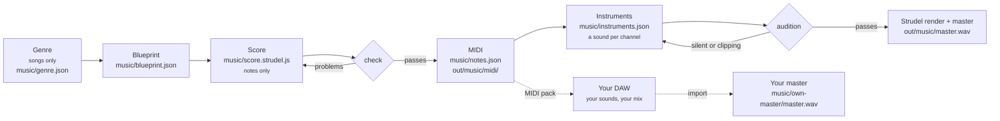

# Music

Mortiflix has one music engine. It writes a song (the `song` pipeline) and a video's original score (the music step of
`explainer`) the same way: Strudel writes the notes, the engine checks them and turns them into MIDI, an instrument is
chosen for every MIDI channel, and the piece is rendered and mastered, or **finished by you in your own DAW from the
MIDI**. Every stage leaves a file you can read, and the engine writes down every decision and every measurement in
`music/MUSIC-SHEET.md`.

The method comes from Mortiflix's song system (Mini Music): the genre researched first, the song planned in words,
notes before sounds, and a machine that checks each stage before the next one starts.

## The stages



| Stage | Who writes it | What the engine checks | What it leaves |
|---|---|---|---|
| **Genre** (songs) | the session, from 5+ sources it read | every field, a hook and a beat element, concrete "how"s | `music/genre.json`, `GENRE.md` |
| **Blueprint** | the session | sections contiguous with a function and an intensity (0–10), the chord chart, one MIDI channel per part, the genre signature, the length | `music/blueprint.json`, `BLUEPRINT.md` |
| **Score** | the session, in Strudel | every note against the chord of the moment (the harmony lock), each section's measured busyness against its asked intensity, hit points within a frame of the picture, nothing past the end, every part playing | `music/check.json` |
| **MIDI** | captured from the score | (it's captured only once the score passes) | `music/notes.json`, `out/music/midi/` (one file per channel, the arrangement, `CUE-SHEET.md`), `midi.zip` |
| **Instruments** | the session, from each channel's real range | every channel covered, two parts in one register never share a timbre, at most one lo-fi sound, low end and top covered, every drum number has a sound | `music/instruments.json` |
| **Audition** | the engine | each instrument plays its part's lowest, middle and highest note: none silent, none clipping | `out/music/audition/*.wav` |
| **Master** | the engine | no stem silent or clipping alone; the balance (low end, mud, stereo width); -14 LUFS, true peak ≤ -1 dBTP | `out/music/master.wav`, `.mp3`, `stems/` |
| **Your master** | you, in your DAW | its length against the score; whether it starts at bar 1 (its first sound against the MIDI's first note) | `music/own-master/` |

## Notes first, sounds second

The score holds only music: pitches, rhythm, velocity and structure, each part on its own MIDI channel. It never says
what anything sounds like. That's what makes the MIDI clean and the whole thing transparent:

```js
// music/score.strudel.js: one cycle is one bar
setcpm(96 / 4)
const cue = (p) => p.filterWhen((t) => t < 8)
sub:   cue(note("<a1 f1 c2 g1>").velocity(.8)).midichan(1)
hook:  cue(note("<[e5 c5 a4 c5] [c5 a4 f5 a4] ...>").velocity("<.7 .85>").mask("<0!4 1!4>")).midichan(3)
drums: cue(note("[36 ~ ~ 36 38 ~ 36 ~], [42*8]").mask("<0!4 1!4>")).midichan(10)   // General MIDI drum numbers
```

```jsonc
// music/instruments.json: what each channel sounds like, and why
{ "concept": "A pure sub under a glassy FM bell; a dry synth kit.",
  "parts": [
    { "channel": 1, "role": "Sub", "sound": "sine", "set": ".lpf(300).release(.3)", "gain": 0.8, "pan": 0, "character": "dark", "why": "a clean floor" },
    { "channel": 3, "role": "Glass hook", "sound": "sine", "set": ".fm(3).fmh(3.5).decay(.4).sustain(.2)", "gain": 0.3, "pan": 0.35, "character": "bright", "why": "glass" },
    { "channel": 10, "role": "Drums", "gain": 0.9, "why": "dry and close",
      "kit": { "36": { "sound": "sine", "set": ".penv(24).decay(.2).sustain(0)" }, "38": { "sound": "pink", "set": ".decay(.12).sustain(0)" },
               "42": { "sound": "white", "set": ".hpf(7000).decay(.03).sustain(0)", "gain": 0.25 } } } ] }
```

When the engine renders, it adds the instruments as one layer on top of the score: it splits the score by channel,
gives each its sound, level, pan and its own effects bus, and stacks them again. A sound can never change a note, so the
MIDI you take into a DAW is exactly what Strudel played.

Sounds are Strudel's built-in synths (sine, triangle, square, sawtooth, supersaw, pulse, and noise), shaped with
filters, envelopes, FM and effects: nothing to download and no licence questions. A sample or soundfont is used only
with a `source` that names its licence, and only when that licence allows your use.

## Videos: finish it yourself from the MIDI (recommended)

For a video, the studio writes the score to the approved animatic: the dramatic reading, a spotting map from the real
timing of every word and cut, a tempo chosen so the hits land on bar lines, a blueprint whose intensity follows the
picture, the score, and the check (hits within a frame). It chooses stand-in instruments so you can review the music
against the picture.

Then, by default, **you finish it**: the project page's **Music** panel has the MIDI pack (every channel on its own
track, tempo, sections and hit points as markers, the cue sheet). Give every channel its sound in your DAW, mix,
export from bar 1 to the end, and **Import your master**. The studio checks it fits the score (length, and that it
starts with bar 1 so the hits stay on the picture), resumes, and mixes your master under the narration. From a
terminal:

```sh
mortiflix music <project>                     # where the music stands
mortiflix music <project> --midi pack.zip     # the MIDI pack
mortiflix music <project> --import master.wav # your master (wav, aiff, flac, mp3, m4a, ogg)
```

Prefer to let Strudel finish it? Choose "Original score, rendered by Strudel" in the brief; "No music" skips the step.

## Songs

The `song` pipeline makes an instrumental song from a genre and a topic. You review twice:

1. **The blueprint**, in words, before any note: which of the genre's unforgettable elements carry the hook and the
   beat, the hook itself, tempo, key, the chords, one MIDI channel per part, and the story section by section with its
   intensity.
2. **The finished song**: the master, the music sheet (every channel with its range, instrument and why; the story
   measured against the plan; the master's numbers), the MIDI and the stems.

Between them the score, the MIDI, the instruments and the master are made and checked in the studio. You can also
choose to finish a song yourself from its MIDI, the same way as a video.

## The music sheet

`music/MUSIC-SHEET.md` is rewritten after every stage. It's the engine's own account of the piece:

```
✔ Genre researched · ✔ Blueprint · ✔ Score checked · ✔ MIDI captured · ✔ Instruments chosen · ✔ Audition · ✔ Mastered (Strudel)

| Ch | Part       | Role   | Plays       | Notes | Instrument                     | Level / pan | Audition | Why this sound |
|----|------------|--------|-------------|-------|--------------------------------|-------------|----------|----------------|
| 1  | Sub        | bass   | F1–C2       | 8     | sine.lpf(300).release(.3)      | 0.8 / 0     | ✔        | a clean floor  |
| 3  | Glass hook | melody | G4–G5       | 16    | sine.fm(3).fmh(3.5)…           | 0.3 / 0.35  | ✔        | glass          |
| 10 | Drums      | drums  | GM 36 38 42 | 48    | 36: sine, 38: pink, 42: white  | 0.9 / 0     | ✔        | dry and close  |
```

## Running the engine by hand

The engine works on any folder with a `music/` directory, no studio needed:

```sh
export MFX_STRUDEL=~/Mortiflix/tools/strudel MFX_CHROME=$(command -v google-chrome-stable)
M=pipelines/_shared/skills/music/strudel.mjs
node $M genre          # songs: check music/genre.json
node $M plan           # check music/blueprint.json, write BLUEPRINT.md
node $M check          # the score: harmony, curve, hits (--video-sec, --fps); captures the MIDI when it passes
node $M instruments    # each channel's range and the sounds; checks music/instruments.json
node $M audition       # every instrument across its part's range
node $M master         # render, stems, balance, -14 LUFS master (songs)
node $M render --stems # a render without mastering (a video's stand-in)
node $M own-master     # an imported master: there, and does it fit?
node $M sheet          # rewrite music/MUSIC-SHEET.md
```

Each command exits 1 with the problems in plain words until its stage is right. The method, stage by stage, is in
`pipelines/_shared/skills/music/SKILL.md`; the craft guides (genre research, picture scoring, melody, the harmony lock,
voicing) are in its `craft/` folder.

## Setup

`mortiflix setup music` installs Strudel (`@strudel/web` from npm, AGPL-3.0) and finds a Chrome to render in. With
music off, the music step is skipped in every video and the song pipeline won't start. The **MIDI pack** setting
delivers the MIDI and stems with every final, even when Strudel finishes the music.
