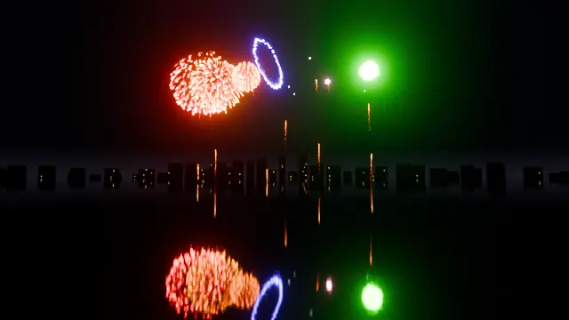
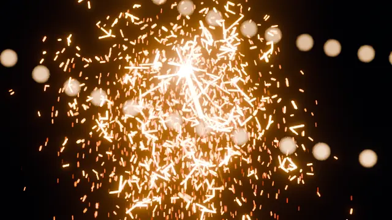
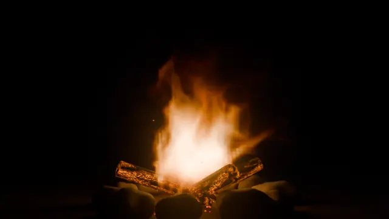
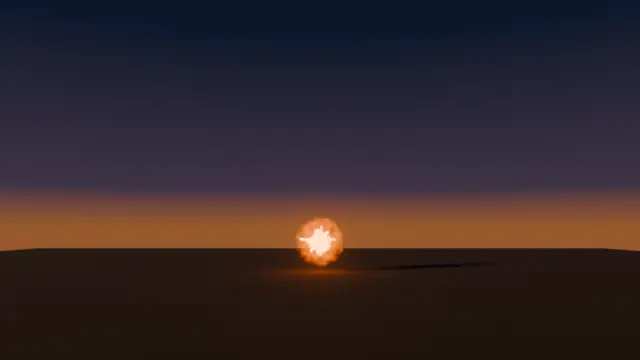
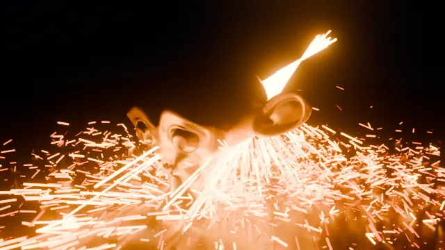
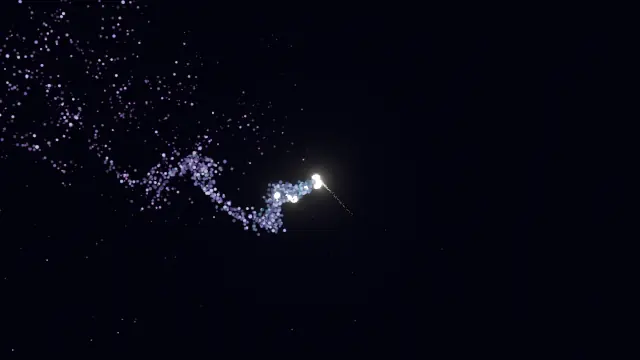
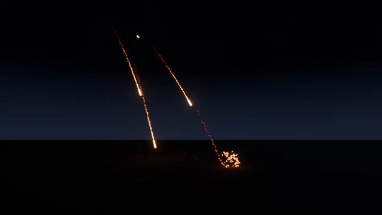
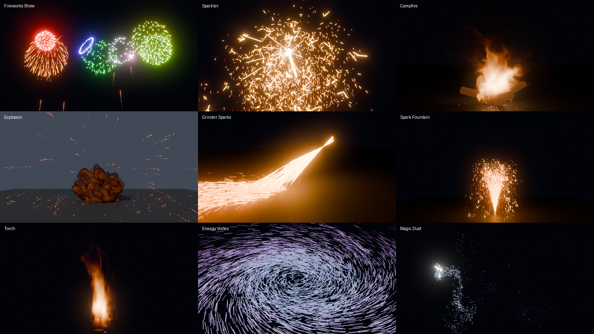

# Nova FX

An optimization-first particle, fire and fireworks engine for Blender 5.2 (works from 4.2).
The simulation runs in a C core with OpenMP. Python only moves data in and out with
zero-copy numpy views, so Blender's UI thread never runs per-particle Python.

## Install

The add-on lives in `addon/nova_fx` and is symlinked as a Blender extension:

```
~/.config/blender/5.2/extensions/user_default/nova_fx -> addon/nova_fx
```

Enable **Nova FX** in Preferences → Add-ons. The core (`lib/libnovacore.so`) is built for this CPU
(`-march=native`). If it's missing, the add-on compiles it on first use (needs gcc or clang). To rebuild by hand:

```
make -C core
```

## Use

- **3D Viewport → Sidebar → Nova FX → Add Effect**, or **Shift+A → Nova FX**.
- Turn on *Camera, World & Glow* in the operator panel for a framed shot, night sky and bloom.
- Press **Play** for a live preview (it simulates as the timeline moves forward; jump to the start to reset).
  Press **Bake** to write every frame to disk (Esc stops). Scrubbing reads the cache.
- To make any object an **Emitter / Collider / Force**, select it and use the buttons in the Nova FX panel.

### Presets

| Preset | What it shows |
|---|---|
| Fireworks Show | 11 shell types: peony, chrysanthemum, willow, palm, ring, crossette, crackle, strobe, heart, multicolour, colour change |
| Sparkler | Iron sparks that fork in flight (split events), incandescent colour |
| Campfire | Combustion fluid, embers riding the flow, popping sparks, logs with glowing cracks |
| Torch | Small licking flame |
| Explosion | Fuel burst with volume expansion, fireball into rolling smoke, debris that trails smoke into the grid |
| Grinder Sparks | Directional spray that bounces and spatters on impact |
| Spark Fountain | Gerb with glitter |
| Magic Dust | Twinkling gradient trail behind an animated wand |
| Drifting Embers | Buoyant embers in wind |
| Energy Vortex | Vortex + attractor forces, streak display |
| Snow | Lit flakes that settle |
| Empty System | Starting point |

## Examples

Every example below is a script in [`examples/`](examples) that builds the whole scene from an empty
file, simulates it and renders it. Run one headless with
`blender -b --factory-startup --python examples/<name>.py`. Add `-- --quick` for a fast, low-quality pass.

<table>
<tr>
<td width="50%"><br>
<b>Fireworks over a lake</b>: eleven shell types, colours from real metal-salt emission lines,
reflections in rippled water. <a href="examples/fireworks_lake.py">fireworks_lake.py</a></td>
<td width="50%"><br>
<b>Sparkler close-up</b>: iron sparks that fork in flight (split events), incandescent Planck colour,
85 mm depth of field. <a href="examples/sparkler_bokeh.py">sparkler_bokeh.py</a></td>
</tr>
<tr>
<td><br>
<b>Campfire at night</b>: combustion on the GPU solver, embers riding the flow, a stone ring lit by
the fire. <a href="examples/campfire_night.py">campfire_night.py</a></td>
<td><br>
<b>Explosion</b>: expanding fuel burst into a rolling fireball and smoke cloud; debris trails sparks and
smoke of its own. <a href="examples/explosion_sequence.py">explosion_sequence.py</a></td>
</tr>
<tr>
<td><br>
<b>Sparks on a mesh</b>: an exact mesh collider (distance field) with continuous collision, so sparks
don't pass through the thin ears. <a href="examples/grinder_monkey.py">grinder_monkey.py</a></td>
<td><br>
<b>Magic wand</b>: a twinkling trail that shifts colour, swirled by divergence-free curl noise.
<a href="examples/magic_wand.py">magic_wand.py</a></td>
</tr>
<tr>
<td><br>
<b>Meteor shower</b>: a custom effect written from scratch (below), with no preset involved.
<a href="examples/meteor_shower.py">meteor_shower.py</a></td>
<td><br>
<b>Every preset</b> straight out of <i>Add Effect</i>, untouched.</td>
</tr>
</table>

(Full-size stills are kept in the original repository, not in this vendored copy.)

### Build an effect in Python

Particle types are the building blocks. Each type has a lifetime, motion, a light model, and *events*
that spawn other types: on death, along a trail, on a split, or on impact. This is the whole meteor
shower above:

```python
import bpy, math

bpy.ops.nova.add_preset(preset="EMPTY")      # an empty system + one emitter
sky = bpy.context.object
n = sky.nova
n.kinds.clear()

def kind(**settings):
    k = n.kinds.add()
    for key, value in settings.items():
        setattr(k, key, value)
    return k

# hot rock: Planck colour, leaves a trail, bursts into sparks when it hits something
kind(name="Meteor", color_mode="BLACKBODY", temp0=3200, life_min=3, life_max=4, emit=60, collide="DIE",
     size_start=0.06, size_end=0.04, trail_kind="Trail", trail_rate=180, hit_kind="Spark", hit_count=60, hit_speed=9)
kind(name="Trail", color_mode="BLACKBODY", temp0=2400, cool=1.8, life_min=0.5, life_max=1.2,
     size_start=0.035, size_end=0.0, emit=25, drag_lin=1.5, gravity=0.2, collide="NONE")
kind(name="Spark", color_mode="BLACKBODY", temp0=2600, cool=1.5, life_min=0.6, life_max=1.6,
     size_start=0.02, size_end=0.006, emit=40, drag_quad=0.5, collide="BOUNCE", bounce=0.35,
     split_kind="Spark", split_rate=1.5, split_count=2, split_max_gen=1)
n.display = "STREAKS"

em = bpy.data.objects["Nova Emitter"]                # meteors enter high up, aimed down and across
em.location = (-14, 30, 26)
em.rotation_euler = (math.radians(130), 0, math.radians(35))
e = em.nova_emitter
e.kind, e.shape, e.radius = "Meteor", "SPHERE", 6.0
e.rate, e.random_timing, e.speed, e.spread = 2.2, True, 26, math.radians(6)

bpy.ops.mesh.primitive_plane_add(size=200)          # anything can be a collider
ground = bpy.context.object
ground.nova_collider.enabled = True
```

Press Play to watch it live, or *Bake* to cache it to disk. The same settings appear in the sidebar
(**N → Nova FX**), so you can build effects there and script them later, or the other way round.

## What it does, and how

### Particles (`core/nova_core.c`)
- **Structure-of-arrays storage, fully parallel:** 1M particles × 4 substeps with 2-octave curl noise
  takes ~80 ms/frame on 16 threads; without noise it's ~33 ms.
- **Deterministic:** randomness comes from hashing (particle id, step, salt), and births are placed by
  a parallel prefix sum. Thread count never changes the result (tested).
- **Event graph per particle type** (like X-Particles' Questions/Actions or tyFlow events):
  - on death: burst with a pattern (Fibonacci sphere, random, ring, palm, crossette, heart, cone, hemisphere)
  - trail: continuous children spread along the frame segment
  - split: Poisson-timed branching with a generation limit (sparklers)
  - on impact: spawn children
  - Children can inherit colour; random hue per shell.
- **Forces:**
  - gravity
  - linear drag, plus implicit quadratic drag (unconditionally stable)
  - buoyancy from temperature
  - wind (acts through drag)
  - divergence-free curl noise (Bridson et al. 2007) with analytic gradient noise
  - force objects: attract, vortex, wind, turbulence, drag
- **Colliders:** plane, sphere, box, or the **exact shape of any mesh**. A mesh is baked once to a signed
  distance field (64³ in about a second) and looked up in O(1). Collider velocity, bounce and friction apply.
- **Continuous collision detection:** each particle sphere-traces its step against every collider's distance
  function, so fast sparks can't tunnel through thin geometry. At one substep, 40 m/s particles vs a 2 cm
  slab: 0% pass through (the previous version let 100% through).
- **Incandescence:** colour comes from the Planck spectrum integrated against CIE 1931 colour matching
  functions (Wyman–Sloan–Shirley fit). Brightness ∝ T⁴ (Stefan–Boltzmann). Cooling is Newton plus
  exact radiative T⁴ cooling, so sparks redden and fade like hot metal.
- **Firework colours:** computed from the real emission lines of the metal salts (SrCl red, BaCl green,
  CuCl blue, Na yellow, Ca orange).
- **Sub-frame emission:** births interpolate the emitter's motion and are pre-aged, so fast emitters
  don't leave bands.

### Fluid (smoke & fire)
- Incompressible Navier–Stokes on a staggered MAC grid.
- **Pressure:** conjugate gradient preconditioned by a geometric multigrid V-cycle (MGPCG,
  McAdams et al. 2010). It converges in 4–6 iterations, where plain CG typically needs hundreds.
- **Advection:**
  - MacCormack with min/max clamping (Selle et al. 2008)
  - advection–reflection (Zehnder, Narain, Thomaszewski 2018), which keeps the swirl energy
    semi-Lagrangian steps lose. It reflects only between two fluid cells.
  - Where a trace leaves the grid, the step falls back to semi-Lagrangian, so open walls stay stable
    (a 128³ fire in a narrow domain holds ~3 m/s for 200 frames)
- **Vorticity confinement** plus curl-noise detail. The noise fades out as the local flow approaches
  half its amplitude, so it adds detail without pumping energy in forever.
- **Combustion:**
  - fuel, ignition temperature, Arrhenius-like burn rate
  - heat release and smoke yield
  - volume expansion fed into the pressure solve, so explosions push outward
- **Sparse tiles (8³), sparse all the way down.** Every per-substep pass follows the effect, not the domain:
  - advection, forces, combustion and both solver levels (fine and coarse) visit only active blocks;
  - the active region is found by scanning only last step's tiles plus tiles a source wrote to;
  - the solver hierarchy is re-typed only where tiles changed;
  - colliders are re-voxelized only when they move, and only inside their boxes;
  - VDB export copies only the active box.

  Memory comes from lazily zeroed pages, so untouched space never becomes resident (256³: 2.1 → 0.5 GB).
  The grid is still stored row by row, so each 4 KB page spans many tiles; tile-ordered storage would cut it further.
- **Safety nets:** expansion capped per substep, and face velocity clamped to 2× CFL. Adaptive CFL substeps.
- **Two-way coupling:** particles ride the flow (embers) and feed smoke, heat and fuel back into the grid
  (debris trails, smoky shells).
- **Output:** OpenVDB (`density`, `heat`, `flame`, optional `velocity`) written on a background thread
  and loaded as a Blender Volume sequence with a blackbody fire material.

### GPU fluid (Vulkan)
- **Setting:** `Fire & Smoke → Device: GPU` runs the whole fluid substep in Vulkan compute (`core/gpu_vk.c`,
  `core/shaders/*.comp`) with the state resident in VRAM.
- **Same solver:** it mirrors the CPU one kernel for kernel, and the tests check that: identical after one frame,
  and after eight frames no cell off by more than 0.5% of peak. Repeated runs give bit-identical results.
- **Pressure solve:** MGPCG with the CG scalars kept on the GPU. The host syncs once per batch of 6 iterations.
- **Sources and deposits:** bucketed by tile on the CPU and gathered per cell on the GPU. No atomics, so results
  are deterministic.
- **Transfers:** the CPU keeps the bookkeeping (solids, multigrid stencils, which are uploaded only when they
  change). Fields come back only for VDB export, and velocity only for particles that ride the flow.
- **Build:** `libvulkan` is loaded at runtime. Shaders are compiled with `glslc` and committed as SPIR-V
  (`core/shaders_spv.h`), so building never needs a shader compiler. Without Vulkan, the add-on falls back to CPU.
- **Limitation:** the GPU solver is dense. For a small fire in a huge domain, the sparse CPU solver can still be faster.

### Blender side
- Native **PointCloud** objects with these attributes: `position`, `radius`, `Cd`, `emit`, `velocity`
  (Cycles motion blur), `age`, `id`, `kind`. Usable in your own shaders and Geometry Nodes.
- **Streak display:** a companion Curves object (`<system> Streaks`) turns each particle into a 2-point curve
  trailing behind its motion. Cycles and EEVEE draw curves natively. At 1M particles, render prep takes
  1.4 s, vs 25 s for the mesh tubes used before. While streaks are on, the point system shows as a
  selectable box.
- **Viewport %** limits how many particles the viewport shows. Renders always use all of them.
- **Cache:** 35 bytes per particle per frame (float16 where precision allows), one `fwrite` per frame.

## Complexity (measured)

N = particles, A = active fluid cells, C = all cells, I ≈ 5 solver iterations at every size.

| Part | Cost per substep |
|---|---|
| Particles | O(N·(1 + forces + colliders)), ~4 ns/particle with no noise, +5 ns per turbulence octave |
| Removing the dead | O(N) only when something died; otherwise children are appended in place |
| Fluid (advect, forces, burn, pressure at every level) | O(A + I·A) |
| Region tracking and solver rebuild | O(changed tiles) + O(C/512) byte scans |
| Collider voxelizing | O(collider box), and only when a collider moves |
| VDB export | O(active box) |

Same plume, empty domain grown from 64³ to 256³ (old → now):
- time: 20 → 113 ms/frame before, now flat at 17–29 ms
- memory: 2.1 GB → 0.5 GB
- VDB export: 800 → 4 ms

4M long-lived particles: 45 → 15 ms per substep.

512³ (134M cells) with a small plume runs at ~32 ms/frame using 2.6 GB. The old dense layout would need ~17 GB.

## Tests

```
python3 tests/test_core.py                                     # core: correctness + speed, ~7 s
blender -b --factory-startup --python tests/blender_presets.py -- --frames 24
blender -b --factory-startup --python tests/blender_render.py -- FIREWORKS 260 out.png CYCLES 64
```

## Researched, not built (yet)

From the paid tools (X-Particles, tyFlow, EmberGen, Pro Pyro, VFX Pro Simulations):
- FLIP/APIC liquids, granular, cloth
- An OpenVDB mesher for particles
- ML upres
- A domain that follows the effect around (sparse tiles cover most of that benefit)
- Tile-ordered grid storage (memory proportional to the effect; pages are currently row-shaped)
- SIMD (8-wide) turbulence noise
- Sparse GPU dispatch (active tiles only) and GPU particles
